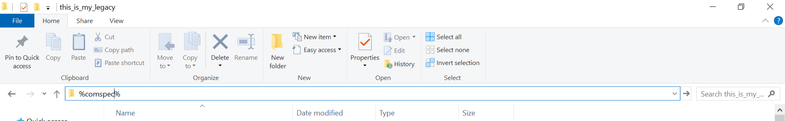

README
===========================
In this file, we mainly discuss how to use Microsoft cmd command line codes to help our office work. I may introduce other ways in this section as I learn more.

****

|Author|Tandesen|
|---|---
|EY_Profile|[![EY-profile]][homepage]
|Favorites|Potato and Ice-tea!
|Contact|![Contact]

****
## Ways to Open CMD Command Line
* `WIN + R` and type `cmd` and hit `ENTER`.
* Open a file folder and type `%comspec%`, then hit `Enter`. This way you go directly to the folder path by default.  

## Basic CMD Commands
* `cd + filepath`: Enter that file path location.
* `cd..` : Return to the former file path location.
* `mkdir + ' ' + filename` : Create single folder in the current file path location.
* `md + ' ' + filename1 + ' ' + filename2 + ...` : Create multiple folders in the current file path location.
* `dir` : Show info of all files in the current file path location.
* `ren + ' ' + filename1 + ' ' + filename2` : Rename filename1 as filename2.
* `COPY + ' ' + filepath1\filename1 + ' ' + filepath2\filename2` : Copy filename1 to filename2.
* `move + ' ' + filepath1\filename1 + ' ' + filepath2\filename2` : Move filename1 to filename2.  

## Some Tricks
* [Merge Multiple CSV Files](https://blog.csdn.net/weixin_43789661/article/details/106504358?utm_medium=distribute.pc_relevant.none-task-blog-BlogCommendFromMachineLearnPai2-1.nonecase&depth_1-utm_source=distribute.pc_relevant.none-task-blog-BlogCommendFromMachineLearnPai2-1.nonecase)(from Joy:smirk:)

Just explore more by Google search or Baidu search! [This link](https://www.digitalcitizen.life/command-prompt-how-use-basic-commands) may help as well.

___Note:___ Please DO use a text editor such as sublime to generate multiple lines of codes which makes your life much easier. You may wanna refer to the sublime folder for more information. **(Upload gif figures for renaming multiple files names in the meantime)**

--------------------------------
[homepage]:https://people.ey.com/PersonImmersive.aspx?accountname=i%3A0%23%2Ef%7Cmembership%7Cmark%2Es%2Etan%40cn%2Eey%2Ecom "My real name is Tandesen! Bazinga!"
[EY-profile]:https://img.shields.io/badge/Tandesen-EY__Profile-blue
[Contact]:https://img.shields.io/badge/Wechat-markts28-brightgreen "Add me beauties!"

