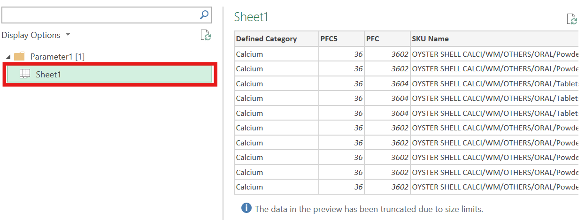

<h1 align="center">
   
  </a>
   
  T.S.
   
</h1>

<h3 align="center">合并 EXCEL 文件</h3>

  
  
  

### 前提假设
有多张 EXCEL 表格，它们的结构是一样的，即列的名字与顺序是一样的。

## 方法一：使用命令行 CMD

 1. **将 EXCEL 文件们调整格式为 `.csv` 文件，并放在同一个本地文件夹中。**
    
 2. **在最上面的地址栏输入 `%comspec%` 调出 CMD 命令行。这个代码相当于打开了 CMD 命令行并进入了当前文件夹地址。**
      
 3. **在 CMD 命令行中输入代码 `copy *.csv combined.csv`，敲击回车。代码意思是将文件夹中所有的 `.csv` 文件合并成一个叫做 `combined.csv` 的文件。代码中 `combined.csv` 文件名部分可自行修改。**
      
 4. **文件夹中会出现一个叫做 `combined.csv` 的文件。**
    
 5. **打开合并好的文件并删除重复的表头的行。因为 `.csv` 文件为文本文件，可用记事本打开，这个操作即将所有文本连接在了一起，所以表头也会重复出现。**
    

## 方法一的优缺点

 1. **优点**
    * 速度超级快，对比使用 `Excel Power Query` 速度快很多。
    * 操作简单，不容易报错。
 2. **缺点**
    * 只对 `.csv` 文件有效，可能需要手动调整文件格式。
    * 需要注意各个表的表头顺序，最后要手动删除重复出现的表头。

## 方法二：Power Query -- Excel 21 世纪最大的福音！

 1. **将 EXCEL 文件们放在同一个文件夹中 (支持文件格式为 `.xlsx` 或 `.xlsb` 等)，并确保他们的 sheet 名字都是一样的，比如都叫 `Sheet1`。**
    
 3. **在 _**文件夹外**_ 新建一个 EXCEL 文件，打开文件，依次点击 `数据` -> `获取数据` -> `从文件` -> `文件夹`。**
    
 4. **选择文件夹地址，点击打开。**
    
 5. **点击 `转换数据` ，进入 `Power Query` 编辑器。这里点击它最左边的按钮 `合并` 可以直接越过后面的 5，6，7 步骤，但我们总是建议 `转换数据` 以详细的查看与自定义编辑。**
     
 6. **点击 `合并文件` 按钮。**
     
 7. **选择 sheet 名字，预览一下是不是妳想合并的内容，点击 `OK` 。**
     
 8. **`Power Query` 编辑器会自动添加一个列，注明文件名字。**
    
 9. **选择 `关闭并加载至` ，将拼接好的文件输出到一个新的 Excel sheet 中。生成的表格为 `Excel 超级表` 。**
    

## 方法二的优缺点

 1. **优点**
    * 可处理 `.xlsx` `.xlsb` 等格式的表格。
    * `Power Query` 在操作上用户友好，可定制化生成最终表格，如添加 `表格来源` 列等。
    * 对于合并同一个表格中多个 sheet 情景同样适用 (在方法三中进行说明)。
 2. **缺点**
    * 相较于 `命令行 CMD` 方法所需时间长，可能会遇到一些 errors。
    * 需要调整所有表格的 sheet 名字一致。

## 方法三：Power Query -- 合并同一个文件中多个 sheets

 1. **如果妳有一个 EXCEL 文件，想要合并其中的很多个 sheets。**
    
 2. **新建一个 EXCEL 文件，打开文件，依次点击 `数据` -> `获取数据` -> `从文件` -> `从 EXCEL 文件`。选择文件并点击打开。**
    
 3. **左键选择点击文件夹，再点击 `转换数据` ，进入 `Power Query` 编辑器。**
    
 4. **在第二列 `数据` 处点击按钮并选择 OK。**
    
 5. **做些数据处理，如删除不需要的列，修改列的名字等。同方法二中最后一步，选择 `关闭并加载至` 。**
****

