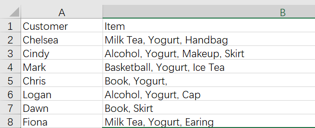
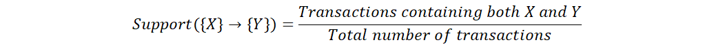
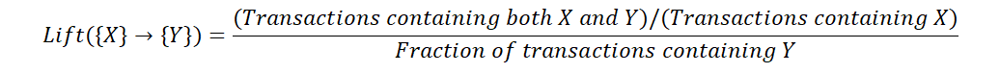

README
===========================
Except for machine learning algorithms introduced in another folder, there are some other algorithms which may help our work. I will introduce the `association rule` and `apriori algorithm` in this file. As I learn more, some other algorithms might be added in this file.

****

|Author|Tandesen|
|---|---
|EY_Profile|[![EY-profile]][homepage]
|Favorites|Potato and Ice-tea!
|Contact|![Contact]

****
## Introduction
The best known anecdote about the association rule is probably the [Beer and Diapers Story](https://jborden.com/2018/12/07/beer-and-diapers-the-perfect-couple/). Wal-Mart used data mining to discover that young American males who bought diapers (nappies) also had a predisposition to buy beer. They moved the beer display closer to the diaper display and increased revenue.  
Suppose that our data contains customers and goods they purchase which is illustrated as following:  

  

When it comes to the association rule with two items A and B, the first thing shows up in one's mind might be calculating the times A and B occur divide the times B occur. But that way the result might be effected by the popularity of B. I.e., if B is a very popular item like towel such that almost everyone would buy it, then we may have that every item is associated with towel. For that reason we introduce the [following definitions](https://en.wikipedia.org/wiki/Association_rule_learning#Definition):

|#|definition|formula|
|---|---|----
|1|Support|
|2|Confidence|
|3|Lift|

One can also refer to [link1](https://blog.csdn.net/reshuibing/article/details/88648215), [link2](https://blog.csdn.net/Lee20093905/article/details/78683146), [link3](https://blog.csdn.net/kl28978113/article/details/76304102/#commentBox), [link4](https://blog.csdn.net/qq_36523839/article/details/82191677) for more details and implementation in python.

For my position as a forensic data analyst, I normally mine the association rules between two features(or columns) and find out data with huge money entry which obey the rules. I consider this algorithm useful because it deals with non-number data which is hard to cope with by using machine learning algorithms introduced in the other folder(one can also convert non-number data into 0-1 matrix and apply machine learning algorithms to it, but the matrix might be rather sparse and dimension reduction operations might be needed).

For the result got with python, one should know that __Lift represents the correlation between A and B. For lift > 1, the higher the lift is, the stronger the positive correlation is(positive correlation means that increasing A tends to increase B). For lift < 1, the lower the lift is, the stronger the negative correlation is(negative correlation means that increasing A tends to decrease B).__

--------------------------------
[homepage]:https://people.ey.com/PersonImmersive.aspx?accountname=i%3A0%23%2Ef%7Cmembership%7Cmark%2Es%2Etan%40cn%2Eey%2Ecom "My real name is Tandesen! Bazinga!"
[EY-profile]:https://img.shields.io/badge/Tandesen-EY__Profile-blue
[Contact]:https://img.shields.io/badge/Wechat-markts28-brightgreen "Add me beauties!"

